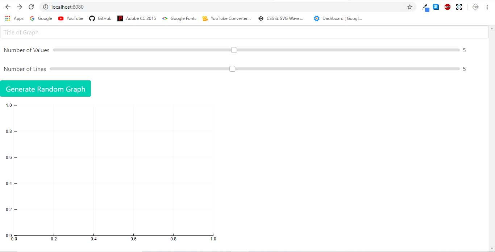
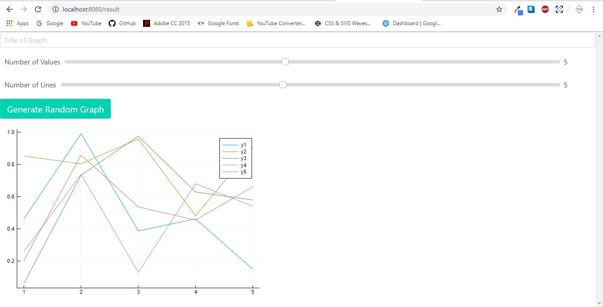
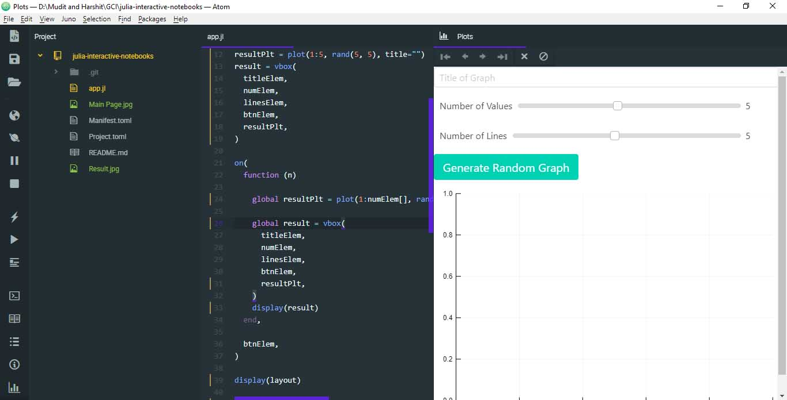
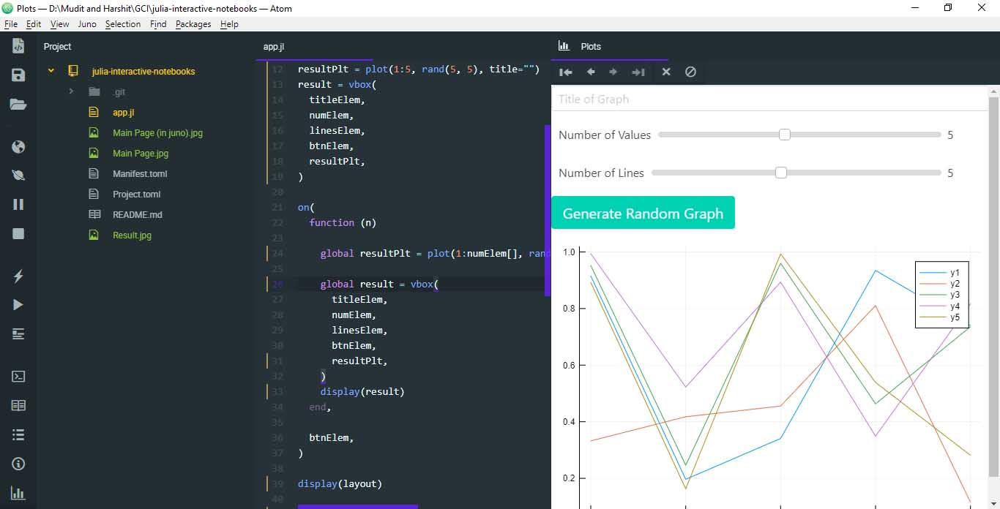

## About the App

It is hosted on `localhost:8080`.

The app is used to generate random line graphs using Plots.jl, It uses Mux.jl as a middleware for WebIO. To see the results
go to `localhost:8080/result`

To use the app in Juno/Atom uncomment the `display` functions

This uses `Mux.jl`, `Interact.jl` and `Plots.jl`

